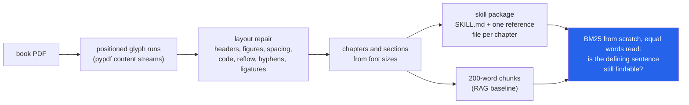

<h1 align="center">book-to-skill (PDF · BM25 · Claude Code skills · Ollama)</h1>
<p align="center"><i>Turn a technical book PDF into an agent skill, and measure how much of the book the skill still knows</i></p>

<p align="center">
  <a href="#the-through-line">The through-line</a> &middot;
  <a href="#findings">Findings</a> &middot;
  <a href="#input--output">Input / Output</a> &middot;
  <a href="#quick-start">Quick start</a> &middot;
  <a href="#what-this-does-not-do">What it does NOT do</a> &middot;
  <a href="#problems-hit-while-building-this">Problems hit</a>
</p>

<p align="center">
  
  
  
  
  <a href="LICENSE"></a>
</p>

Inspired by [virgiliojr94/book-to-skill](https://github.com/virgiliojr94/book-to-skill); no code from it is used.

---

## The through-line



A skill is a compressed copy of the book that an agent reads instead of the book. This repo
builds the whole pipeline without a model (PDF to text, text to structure, structure to a
Claude Code skill), then asks the question the skill format hides: when the agent opens the
skill, is the passage that answers its question still in there?

It is scored on 289 definition questions from two openly licensed books, with gold passages
taken from the author's own LaTeX markup rather than from anything this pipeline produced,
and against a text edition of each book that the PDF was not involved in making.

> **The skill beats chance only on the questions its own selection rule already points at.
> At 21% of the book's words, the extractive skill keeps the defining sentence for 52% of
> questions against 27% for random sentences at the same budget. But its defining-phrase
> regex matches 39% of gold sentences and only 5% of book sentences (8x enrichment); it keeps
> 94% of those, and on the other 61% of questions it keeps 26%, the same as random (26%).
> Reading the same 1,000 words, BM25 reaches the gold passage 88% of the time over the book
> and 51% over the skill.**

## Findings

Every number below is in a file under [`results/`](results/), produced on this machine by
`book-to-skill experiments`. Intervals are 95% bootstrap intervals over questions (2,000
resamples); differences are paired on the same questions. Random controls are the mean over
20 seeds, with the standard deviation across seeds.

| | Measured on | Result | File |
|---|---|---|---|
| **Does a skill keep the evidence?** | 289 questions, 2 books | Gold sentence present in the skill for **52.2%** [46.4, 58.1] of questions; random sentences at the same budget keep **27.3%** (sd 2.4); the skill without its definitions section keeps **21.8%**, random at *its* budget **20.4%** (sd 2.6), i.e. chance | `retrieval_pooled.json` `controls` |
| **How much of that is the selection rule?** | same | The definitions regex matches **38.8%** of gold sentences vs **4.8%** of book sentences. Matched: skill keeps **93.8%**. Unmatched: skill **26.0%**, random at the same budget **25.6%** (sd 2.5) | `retrieval_pooled.json` `definition_rule` |
| **RAG over the book vs over the skill, equal reading** | same | gold passage within the first 1,000 retrieved words: book chunks **88.2%**, skill in equal-size chunks **50.9%** (paired **−37.4 points** [−44.3, −30.5]), whole skill files **43.9%** | `retrieval_pooled.json` |
| **Does layout repair matter downstream?** | same | Without repair 10% of gold sentences are no longer findable as text, and recall@1000 words falls from **88.2%** to **74.7%** (paired **−13.5 points** [−18.0, −9.0]) | `retrieval_pooled.json` |
| **Extraction quality** | 48 chapters, 3 books, vs each book's HTML edition | token F1 vs pypdf's own `extract_text`: Think Python **0.950 → 0.975**, Think Stats **0.927 → 0.971**, Pro Git **0.997 → 0.999** | `extraction.json` |
| **Code listings** | 1,450 multi-line listings | recovered verbatim with indentation: Think Python **35% → 92%**, Think Stats **35% → 81%**, Pro Git **58% → 81%**; of the indented ones pypdf recovers 0%, 0% and 38% | `extraction.json` |
| **Structure vs the real table of contents** | 48 chapters, 459 sections | font-size detection finds **48/48** chapters and **459/459** sections (one extra section in Think Python), as good as reading the PDF's own bookmarks | `structure.json` |

### What the numbers say

**The skill's advantage over chance is its definitions regex, and that regex partly
reproduces how the questions were chosen.** Gold sentences are the ones holding a term the
author set in bold, and authors bold a term where they define it ("... is called a
*variable*"). The skill writer never looks at bold type, but its "Key definitions" section
is filled by a regex for defining phrases ("is called", "refers to", "is defined as" ...),
which matches 38.8% of gold sentences and 4.8% of all book sentences: an 8x enrichment. The
definitions section alone contains 36.3% of gold sentences. Split the questions by whether
the regex matches the gold sentence and the picture is plain: on matched questions the skill
keeps 93.8%; on unmatched ones it keeps 26.0%, indistinguishable from random sentences at
the same budget (25.6%, sd 2.5 over 20 seeds). Remove the definitions section and the skill
is at chance overall (21.8% vs 20.4%, sd 2.6). So the question set is not built *from* the
pipeline, but it and the skill writer share a proxy, and the 52% headline should be read as
"a definitions section finds definitions", not as general evidence retention. Questions of
another kind would see roughly the compression rate.

*Correction to an earlier version of this README*, which said the ablated skill (21.8%) fell
*below* a random control of 29.8%. That control used the full skill's larger budget (23,472
vs 17,521 words) and a single seed; budget-matched and over 20 seeds the ablation is at
chance, and the full-budget control is 27.3%, not 29.8%.

**At equal reading cost the gap is wider than top-k suggested.** Book chunks average 148
words, the skill's reference files 659, so "top 5" meant ~740 words from the book and ~3,300
from the skill. Scoring instead whether the gold passage lies within the first N retrieved
words (the unit that crosses N is cut at N): at 1,000 words the book reaches 88.2%, the skill
chunked the same way as the book (163 words per chunk) 50.9%, and whole skill files 43.9%;
at 250 words whole files manage 13.8%. The skill's ceiling is the 52.2% whose evidence
survived at all, and chunked skill retrieval gets within 1.4 points of it by 1,000 words.

**The comparison between corpora does not hinge on the matching threshold.** A unit
"contains" the gold sentence when it holds at least 60% of the sentence's word trigrams. At
40% and 80% the order of the corpora is unchanged; the skill's count moves by one question,
the random control's by six, the unrepaired chunks' by thirteen, because broken words cut
trigrams (`evidence_threshold_sensitivity`).

**Layout repair is a TeX problem.** On the two pdflatex books, repair lifts chapter token
F1 by 2.5 [2.3, 2.7] and 4.4 [3.8, 5.0] points, removes all 1,641 ligature glyphs and 545
broken line-end hyphenations, and makes 91% and 84% of indented listings recoverable where
pypdf recovers none. On Pro Git, set by Asciidoctor PDF with no ligatures and no
hyphenation, pypdf's own text is already at F1 0.997; repair adds 0.1 points, most of it from
removing page-number footers, and matters only for listings (58% → 81%). The skills keep 15%
(Think Python) and 20% (Think Stats) of the books' multi-line code listings.

**Structure detection on these born-digital books is close to solved, and that is not the
interesting part.** Font size alone recovers every chapter and section of all three books,
matching the PDF outline. Two of the three books needed a rule to get there: Think Python
sets "Chapter 7" as a separate larger line, and Pro Git prints no chapter numbers at all, so
unnumbered title-level headings with at least two sections are numbered in order. Without
layout repair, figure labels and running headers leak into headings: 19/21, 13/14 and 12/13
chapters are found, and 29, 18 and 1 section titles are lost. Outside these three books it
can fail (a thesis whose title page read as the only numbered chapter produced a one-file
skill; see Problems hit), so `convert` now refuses when numbered chapters hold under 20% of
the text.

**Not a finding.** Book chunks contain 100% of the gold sentences because the question set
was filtered to sentences that occur in the extracted PDF text: the LaTeX on GitHub and the
published PDF are different revisions, and one Think Stats sentence had been reworded, so it
was dropped. That 1.000 is a construction check, not a result.

### The question set

No existing QA set covers these books, so it is built from the author's own markup, never
from this pipeline's output:

1. Every end-of-chapter **Glossary** entry in the LaTeX source (`\item[term:] definition`) is
   a question: *"In the book, what is meant by 'term'?"*, with the glossary definition as the
   reference answer (356 entries).
2. Its **gold passage** is the body paragraph where the author set that term in bold
   (`{\bf term}`, plural allowed) when introducing it; the gold sentence is the sentence
   holding the bold term. 66 terms are bold only in the glossary and are dropped.
3. **Glossary sections are held out** of every corpus and of skill generation, so no arm
   can answer by finding the glossary entry. The skill writer does not use bold type.

That makes the set independent of the pipeline, but not of the skill writer's heuristics:
a bolded term marks a definition, and the writer's definitions regex looks for definitions,
so the two overlap by construction (8x enrichment, above). The regex-matched / unmatched
split is reported for every result that depends on it (`definition_rule` in
`retrieval_pooled.json` and `books.json`). A question set built from something other than
glossaries (exercise answers, for instance) is the obvious next step and is not done.

Result: 290 questions, 289 after the revision filter (Think Python 184, Think Stats 105),
listed with their gold sentences in [`results/questions.jsonl`](results/questions.jsonl)
(CC BY-NC 3.0 extracts; see `results/NOTICE`). Two query forms are scored: the term
question, and the glossary definition as the query.

### The model arm (built and tested, queued, not run)

`book-to-skill model-arm` has a local model (`qwen2.5:14b-instruct` through Ollama) write
every chapter's reference file at the same word budget as the extractive file, then answers
all 289 questions four ways: **closed book**, **RAG** (top-5 BM25 book chunks), **skill** (the
model reads SKILL.md, names a reference file, answers from it: two calls, as an agent would)
and **both**, each with the extractive and the model-written skill. Answers are graded by
token F1 against the glossary definition and by the same model as a judge. Every generation
is cached on disk by (model, prompt, options), so a stopped run resumes.
`tests/test_model_arm_run.py` runs `model_arm.run()`, `plan()` and the `model-arm` command
end to end on a two-chapter PDF with a fake transport: every planned request is either a
real call or a cache hit, and a second run makes no calls. It has not been run on a model:
`scripts/run_models.sh --dry-run` plans **4,081 requests** (35 generation, 4,046
answer/route/judge), an upper bound, since identical prompts are generated once.

## Input / Output

All six samples are pasted verbatim from the commands shown; where a sample is cut, the cut
is marked with `[...]` and says what was left out.

**1. A PDF whose correct answer is known** (`uv run python demo.py`, first 14 lines of its
output; the rest prints the skill it writes). The demo writes a six-page PDF with every
defect the repairs target planted in it, runs the pipeline and checks each one.

```
input: tiny-book.pdf, 6 pages, title found: 'A Tiny Book'

  PASS  running header removed
  PASS  page number offset found
  PASS  chapter opener kept
  PASS  figure label dropped
  PASS  line-break hyphen joined
  PASS  real compound kept
  PASS  code indentation kept
  PASS  space at font change
  PASS  chapters
  PASS  sections

10/10 checks passed against the known answer
```

**2. A real page, before and after** (`uv run python scripts/before_after.py`, Think Python
PDF page 34). pypdf's `extract_text()`, first 12 lines of the page:

```
12 Chapter 2. Variables, expressions and statements
• Parentheses have the highest precedence and can be used to force an expression to
evaluate in the order you want. Since expressions in parentheses are evaluated first,
2 * (3-1) is 4, and (1+1)**(5-2) is 8. You can also use parentheses to make an
expression easier to read, as in (minute * 100) / 60 , even if it doesn’t change the
result.
• Exponentiation has the next highest precedence, so 1 + 2**3 is 9, not 27, and 2 *
3**2 is 18, not 36.
• Multiplication and Division have higher precedence than Addition and Subtraction.
So 2*3-1 is 5, not 4, and 6+4/2 is 8, not 5.
• Operators with the same precedence are evaluated from left to right (except exponen-
tiation). So in the expression degrees / 2 * pi , the division happens first and the
```

book-to-skill, first four blocks of the same page: running header gone, `fi` ligatures
expanded, `exponen-/tiation` rejoined, paragraphs reflowed.

```
[paragraph] • Parentheses have the highest precedence and can be used to force an expression to evaluate in the order you want. Since expressions in parentheses are evaluated first, 2 * (3-1) is 4, and (1+1)**(5-2) is 8. You can also use parentheses to make an expression easier to read, as in (minute * 100) / 60, even if it doesn’t change the result.
[paragraph] • Exponentiation has the next highest precedence, so 1 + 2**3 is 9, not 27, and 2 * 3**2 is 18, not 36.
[paragraph] • Multiplication and Division have higher precedence than Addition and Subtraction. So 2*3-1 is 5, not 4, and 6+4/2 is 8, not 5.
[paragraph] • Operators with the same precedence are evaluated from left to right (except exponentiation). So in the expression degrees / 2 * pi, the division happens first and the result is multiplied by pi. To divide by 2 π, you can use parentheses or write degrees / 2 / pi.
```

(`2 π` is a real remaining error: the math-font glyph is spaced from the digit.)

**3. A code listing** (same script, Think Stats PDF page 32). pypdf loses the indentation:

```
def MakePregMap(df):
d = defaultdict(list)
for index, caseid in df.caseid.iteritems():
d[caseid].append(index)
return d
```

book-to-skill rebuilds it from the glyphs' x positions:

```
def MakePregMap(df):
    d = defaultdict(list)
    for index, caseid in df.caseid.iteritems():
        d[caseid].append(index)
    return d
```

**4. A book that prints no chapter numbers** (`book-to-skill inspect data/raw/progit.pdf`,
complete output):

```
title: Pro Git
pages: 501   body font: 10.5pt   heading sizes: {'chapter': 22.0, 'section': 18.0}
repairs: 500 header/footer lines, 0 figure runs removed; 1 hyphenations joined (51 kept); 0 ligatures; 912 code blocks; 1 kerning splits
text inside numbered chapters: 92%
header/footer lines removed, e.g.: 1 | 2 | 3
    Pro Git  (p. 2-2)
    Table of Contents  (p. 3-3)
    License  (p. 7-7)
    Preface by Scott Chacon  (p. 8-8)
    Preface by Ben Straub  (p. 9-9)
    Dedications  (p. 10-10)
    Contributors  (p. 11-11)
    Introduction  (p. 14-15)
  1 Getting Started  (p. 16-31)
  2 Git Basics  (p. 32-68)
  3 Git Branching  (p. 69-110)
  4 Git on the Server  (p. 111-131)
  5 Distributed Git  (p. 132-171)
  6 GitHub  (p. 172-223)
  7 Git Tools  (p. 224-341)
  8 Customizing Git  (p. 342-372)
  9 Git and Other Systems  (p. 373-419)
 10 Git Internals  (p. 420-458)
  A Appendix A: Git in Other Environments  (p. 459-471)
  B Appendix B: Embedding Git in your Applications  (p. 472-483)
  C Appendix C: Git Commands  (p. 484-498)
    Index  (p. 499-499)
```

"1 hyphenations joined (51 kept)": Pro Git is ragged-right and never hyphenates words, and
the book's own attested cases tell the de-hyphenator so (see Problems hit).

**5. Search** (`book-to-skill search data/raw/thinkpython2.pdf "What is an accumulator?" -k 3`,
complete output; `search` does not hold out the glossary unless asked with
`--exclude-section Glossary`):

```
1. [chapter 10 / Map, filter and reduce] score 4.60
   res is initialized with an empty list; each time through the loop, we append the next element. So res is another kind of accumulator. An operation like capitalize_all is sometimes called a map because it “maps” a function (in this case the method capitalize) onto each of the elements in a sequence. ...
2. [chapter 10 / Glossary] score 4.50
   Glossary list: A sequence of values. element: One of the values in a list (or other sequence), also called items. nested list: A list that is an element of another list. accumulator: A variable used in a loop to add up or accumulate a result. augmented assignment: A statement that updates the value ...
3. [chapter 10 / Map, filter and reduce] score 3.99
   Map, filter and reduce To add up all the numbers in a list, you can use a loop like this: def add_all(t): total = 0 for x in t: total += x return total total is initialized to 0. Each time through the loop, x gets one element from the list. The += operator provides a short way to update a variable. ...
```

**6. The skill it writes** (complete output of `book-to-skill convert
data/raw/thinkpython2.pdf --title "Think Python 2e" --exclude-section Glossary --license
"Allen B. Downey, Green Tea Press, CC BY-NC 3.0 (...)" --out examples`; this is the skill the
evaluation scores, and the files are in [`examples/`](examples/)):

```
wrote examples\think-python-2e
  SKILL.md               529 words
  references/*.md      13400 words in 21 files
  chapter text         61699 words (82% of the book's text)
  reference / chapter words: 0.22
```

`examples/think-python-2e/SKILL.md`, first 16 of its 35 lines `[...]` (the
remaining rows of the chapter index cut):

```markdown
---
name: think-python-2e
description: "Knowledge from the book \"Think Python 2e\": The way of the program; Variables, expressions and statements; Functions; Case study: interface design; Conditionals and recursion; Fruitful functions; Iteration; Strings; Case study: word play; Lists; Dictionaries; Tuples; Case study: data structure selection; Files; Classes and objects; Classes and functions; Classes and methods; Inheritance; The Goodies; Debugging; Analysis of Algorithms. Use when a task needs the book's definitions, explanations or worked examples on these topics."
license: "Allen B. Downey, Green Tea Press, CC BY-NC 3.0 (https://creativecommons.org/licenses/by-nc/3.0/)"
---

# Think Python 2e

Extracted from *Think Python 2e*: Allen B. Downey, Green Tea Press, CC BY-NC 3.0 (https://creativecommons.org/licenses/by-nc/3.0/).

Each chapter of the book has a reference file with its sections, key definitions and worked examples. Find the chapter below whose topics match the task, then read only that file.

| Chapter | Topics | File |
|---|---|---|
| 1. The way of the program | formal, natural languages, tokens, hello world, ambiguity, meaning, instructions, basic | `references/ch01-the-way-of-the-program.md` |
| 2. Variables, expressions and statements | script, interactive mode, spam, precedence, illegal, semantic, comments, syntax error | `references/ch02-variables-expressions-and-statements.md` |
[...]
```

`references/ch10-lists.md`, its complete "Key definitions" section. This is where the
retained evidence lives, and the regex's misses are visible too: the fifth and the last
bullets are not definitions.

```markdown
## Key definitions

- The values in a list are called elements or sometimes items.
- A list that contains no elements is called an empty list; you can create one with empty brackets, [].
- isupper is a string method that returns True if the string contains only upper case letters.
- An operation like only_upper is called a filter because it selects some of the elements and filters out the others.
- We know that a and b both refer to a string, but we don’t know whether they refer to the same string.
- In one case, a and b refer to two different objects that have the same value.
- In the second case, they refer to the same object.
- To check whether two variables refer to the same object, you can use the is operator.
- In this example, Python only created one string object, and both a and b refer to it.
- If a refers to an object and you assign b = a, then both variables refer to the same object:
- The association of a variable with an object is called a reference.
- It almost never makes a difference whether a and b refer to the same string or not.
```

## Quick start

```bash
git clone https://github.com/hammasbuilds/book-to-skill
cd book-to-skill
uv sync
uv run pytest -q                 # 122 tests, no data, no network, no model
uv run python demo.py            # the known-answer PDF above

# your own book
uv run book-to-skill inspect mybook.pdf --sections
uv run book-to-skill convert mybook.pdf --out ~/.claude/skills --exclude-section Exercises \n    --license "Author, Publisher, licence"   # recorded in SKILL.md
uv run book-to-skill search mybook.pdf "what is a closure"

# reproduce every number in this README
bash scripts/fetch_data.sh       # three books + references, checked against data/MANIFEST.sha256
uv run book-to-skill experiments # about 14 minutes, writes results/*.json

# the model arm (needs Ollama with qwen2.5:14b-instruct and a free GPU)
bash scripts/run_models.sh --dry-run
bash scripts/run_models.sh
```

## Layout

```
src/booktoskill/
  pdftext.py       pypdf visitor -> positioned runs; width tables via ToUnicode; figure (XObject) flag
  layout.py        the repairs: figures, headers/page numbers, spacing, code, reflow, hyphens, ligatures
  structure.py     chapters and sections from font sizes; numbering for books that print none
  chunking.py      section-bounded ~200-word chunks for the book and for skill files
  bm25.py          Okapi BM25 and a light stemmer, from scratch
  skill.py         the extractive skill writer: SKILL.md index + per-chapter reference files
  references.py    HTML editions (hevea, Asciidoctor) and the LaTeX glossary question set
  metrics.py       token F1 vs a reference, code-listing recovery, evidence coverage, bootstrap
  experiments.py   every no-model result, with its controls and ablations
  llm.py           Ollama client, disk cache keyed by (model, prompt, options), fake client
  llm_skill.py     the model writer for reference files, at the extractive file's word budget
  answering.py     closed book / RAG / skill / both, routing, judge, token F1
  model_arm.py     generation + QA end to end, and the dry-run plan
  samplepdf.py     writes small PDFs with known contents (demo and tests)
  cli.py           convert | inspect | search | experiments | model-arm
scripts/fetch_data.sh   downloads with resume and hashes
scripts/run_models.sh   the model arm, with RAM/GPU/Ollama checks and --dry-run
scripts/before_after.py prints Input/Output samples 2 and 3
results/                every number in this README
examples/               the extractive skills for both Think books
```

## Requirements

Python 3.11+ and `uv`. One runtime dependency, `pypdf` (pure Python); everything after the
content-stream decoding is standard library. The model arm additionally needs Ollama serving
`qwen2.5:14b-instruct` (about 9 GB of VRAM). No API keys.

## Tests

```bash
uv run pytest -q     # 122 tests, about 15 seconds
```

Every test builds its own input. The PDF tests write small PDFs with exact geometry (fonts
with declared width tables, a running header, a hyphen break, a figure drawn inside a form
XObject, indentation drawn as no-break spaces) and assert what comes back. The model arm is
driven by a deterministic fake client, including `model_arm.run()` and the `model-arm`
command end to end. A synthetic thesis (title page that reads like "1 ...", unnumbered
chapters) guards the structure fallback. No test reads `data/`, touches the network or loads a
model; `experiments` refuses to run and says why when the data is missing.

## What this does NOT do

- **No OCR.** A scanned PDF has no text layer; `convert` says so and stops.
- **No multi-column layout.** Lines are read top to bottom across the page, so two-column
  pages (each book's index, which is not used) come out interleaved.
- **No tables or display maths.** Table cells come out as lines; equations lose their
  structure (the HTML editions have `σ2`, `R2`, `∑` that the PDF text does not match).
- **Column alignment inside a code line is not recovered** when pypdf hands over the whole
  line as one run; indentation is, because it comes from the line's x position.
- **Only born-digital books from two toolchains were measured**: pdflatex (two books by one
  author with one template) and Asciidoctor PDF. A Word, InDesign or Sphinx book may break
  rules tuned here, the 0.06 em word-space threshold in particular.
- **The question set is definitions only, and shares a proxy with the skill writer.**
  Bolded terms (the gold rule) and the definitions regex (the writer's rule) both mark
  definitions; the split by regex match is reported, and outside it the skill is at chance.
  No question set independent of glossaries was built.
- **The model arm has not been run**, so there is no answer-accuracy result yet.

## Problems hit while building this

- **Font width tables lie about subsets.** Asciidoctor PDF embeds per-page subsets of its
  code font whose `/Widths` list every unused code at the `.notdef` width, so the font looked
  proportional and no code was detected. Monospace is now decided from the widths of the
  letters a font actually draws, and a tiny subset inherits its family's verdict.
- **Characters are not codes.** Prawn renumbers glyphs, so `widths[ord(ch) - FirstChar]`
  measured the wrong glyphs; widths are now read through each font's ToUnicode CMap
  (a 30-line parser in `pdftext.py`).
- **Indentation drawn as glyphs.** Prawn starts every code line at the same x and draws the
  indent as a no-break space plus spaces, so geometric indentation found nothing and Pro Git
  listings recovered worse than pypdf's plain text (50% vs 58%). pypdf's inferred spaces are
  plain spaces; only a run that starts with a no-break space is treated as drawn padding.
- **One hyphenation rule does not fit two typesetters.** "Keep the hyphen only if the
  hyphenated form occurs elsewhere" was right for TeX, which hyphenates ordinary words, and
  produced `branchmanagement` and `nondevelopers` in Pro Git, which only ever breaks at real
  hyphens. Unattested breaks now follow the majority of the book's attested ones.
- **A circled digit crashed the page-number detector.** `"②".isdigit()` is true in Python;
  Pro Git uses circled digits for code callouts. Found only because a third book was added.
- **Header removal ate chapter openers.** "Chapter 1" starts page 22 and carries the right
  page number for the page offset, so it looked like a running header. Headers must also sit
  in the band where most page-number lines sit.
- **Blank lines split code listings.** A blank line inside a listing opened a new block.
  A gap of up to about two line heights now stays inside the listing and becomes blank
  lines; together with comparing listings nested in list items dedented (the HTML keeps
  their outer indent, the PDF's x positions do not), Think Stats listing recovery went from
  34% to 81%.
- **Figure text is text.** Think Stats' matplotlib figures are embedded PDF with real text
  for every tick label: 1,271 runs, about 6% of the extracted tokens. Runs drawn inside form
  XObjects are now dropped, unless forms hold most of the book's text (some producers wrap
  whole pages in one).
- **Sections are not the most common heading.** "The most frequent size below chapter
  level" picked Pro Git's subsections (13 pt, more numerous than its 18 pt sections); it is
  now the largest size below chapter level that recurs, with "Chapter N" labels excluded.
- **Found by an independent review, and fixed.** (1) The ablated skill was compared with a
  random control at the *full* skill's budget and one seed, which made it look worse than
  chance; controls are now budget-matched per variant over 20 seeds. (2) "200-word" skill
  chunks averaged 44 words because the chunker split at every heading, and top-5 compared
  740 book words with 3,300 skill words; skill files are now packed like book chunks and the
  headline is recall at an equal number of words read. (3) One stray numbered heading (a
  thesis title page) switched off chapter numbering for the whole book, so `convert` wrote a
  one-file skill from 388 words and exited 0; numbering now needs most chapter-like headings
  to agree, and `convert` refuses below 20% coverage. (4) Non-ASCII titles crashed output on
  a Windows pipe. (5) README samples had been trimmed without marking the cuts.
- **greenteapress.com served the PDFs at about 6 KB/s** from here. `fetch_data.sh` resumes
  and checks every file against the hashes the results were produced from.

## Keywords

PDF text extraction &middot; layout analysis &middot; document structure &middot; Claude Code skills &middot; agent skills &middot; RAG &middot; BM25 &middot; retrieval evaluation &middot; evidence retention &middot; summarisation loss &middot; de-hyphenation &middot; ligatures &middot; code extraction &middot; local LLM &middot; Ollama &middot; reproducible evaluation

## License

Code: MIT. The books are not in this repository and keep their own licences: *Think Python
2e* and *Think Stats 2e* by Allen B. Downey (Green Tea Press, CC BY-NC 3.0) and *Pro Git*
by Scott Chacon and Ben Straub (CC BY-NC-SA 3.0). `examples/` and `results/questions.jsonl`
contain extracts of the two Think books and are shared under CC BY-NC 3.0 with that
attribution ([`examples/NOTICE`](examples/NOTICE), [`results/NOTICE`](results/NOTICE); each
example `SKILL.md` carries it in its `license` field).
