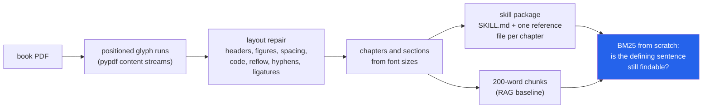

<h1 align="center">book-to-skill (PDF · BM25 · Claude Code skills · Ollama)</h1>
<p align="center"><i>Turn a technical book PDF into an agent skill, and measure how much of the book the skill still knows</i></p>

<p align="center">
  <a href="#the-through-line">The through-line</a> &middot;
  <a href="#findings">Findings</a> &middot;
  <a href="#input--output">Input / Output</a> &middot;
  <a href="#quick-start">Quick start</a> &middot;
  <a href="#what-this-does-not-do">What it does NOT do</a> &middot;
  <a href="#problems-hit-while-building-this">Problems hit</a>
</p>

<p align="center">
  
  
  
  
  <a href="LICENSE"></a>
</p>

Inspired by [virgiliojr94/book-to-skill](https://github.com/virgiliojr94/book-to-skill); no code from it is used.

---

## The through-line



A skill is a compressed copy of the book that an agent reads instead of the book. This repo
builds the whole pipeline without a model (PDF to text, text to structure, structure to a
Claude Code skill), then asks the question the skill format hides: when the agent opens the
skill, is the passage that answers its question still in there?

It is scored on 289 definition questions from two openly licensed books, with gold passages
taken from the author's own LaTeX markup rather than from anything this pipeline produced,
and against a text edition of each book that the PDF was not involved in making.

> **The skill kept the evidence for about half the questions, and only because one of its
> sections was built to. At 21% of the book's words, the extractive skill still contains the
> defining sentence for 52% of questions; a random 21% of the book's sentences contains it
> for 30%, and the same skill without its "Key definitions" section for 22%. BM25 finds the
> gold passage in the top 5 for 84% of questions over the book's own chunks and for 52% over
> the skill's files.**

## Findings

Every number below is in a file under [`results/`](results/), produced on this machine by
`book-to-skill experiments`. Intervals are 95% bootstrap intervals over questions (2,000
resamples); differences are paired on the same questions.

| | Measured on | Result | File |
|---|---|---|---|
| **Does a skill keep the evidence?** | 289 questions, 2 books | The defining sentence survives in the skill for **52.2%** [46.4, 58.1] of questions, vs **29.8%** [24.6, 35.3] for random sentences at the same word budget and **21.8%** for the skill without its definitions section | `retrieval_pooled.json` |
| **RAG over the book vs over the skill** | same | recall@5 of the gold passage: **84.4%** over 200-word book chunks, **51.6%** over whole skill files, paired difference **−32.9 points** [−40.5, −25.3] | `retrieval_pooled.json` |
| **Does layout repair matter downstream?** | same | Without repair, 10% of gold sentences are no longer findable as text at all, and recall@5 falls from **84.4%** to **72.3%** (paired **−12.1 points** [−16.6, −8.0]) | `retrieval_pooled.json` |
| **Extraction quality** | 48 chapters, 3 books, vs each book's HTML edition | token F1 vs pypdf's own `extract_text`: Think Python **0.950 → 0.975**, Think Stats **0.927 → 0.971**, Pro Git **0.997 → 0.999** | `extraction.json` |
| **Code listings** | 1,450 multi-line listings | recovered verbatim with indentation: Think Python **35% → 92%**, Think Stats **35% → 81%**, Pro Git **58% → 81%**; of the indented ones pypdf recovers 0%, 0% and 38% | `extraction.json` |
| **Structure vs the real table of contents** | 48 chapters, 459 sections | font-size detection finds **48/48** chapters and **459/459** sections (one extra section in Think Python), as good as reading the PDF's own bookmarks | `structure.json` |

### What the numbers say

**The skill is only as good as the one thing it was built to keep.** The extractive writer
keeps four kinds of content per chapter: two lead sentences per section, up to twelve
sentences that match a defining pattern ("is called", "refers to", "is defined as" ...), up
to four worked examples, and "when to use" topics. Ablating the definitions section drops
evidence retention from 52% to 22%, *below* the random-sentence control (30%). The lead
sentences and code examples, which is most of the file, carry less definitional evidence
than a random sample of the same size. For a question type the rules were not written for,
expect retention near the compression rate or worse. The skills keep 15% (Think Python) and
20% (Think Stats) of the books' multi-line code listings.

**The comparison between corpora does not hinge on the matching threshold.** A unit "contains"
the gold sentence when it holds at least 60% of the sentence's word trigrams. At 40% and 80%
the order of the corpora is unchanged; the skill's count moves by one question, the random
control's by eight, and the unrepaired chunks' by thirteen, because broken words cut trigrams
(`evidence_threshold_sensitivity`).

**Whole files look better than chunks, for a boring reason.** recall@5 over the 35 whole
reference files (51.6%) beats recall over the skill split into 200-word chunks (44.3%), but
five files out of 35 is a seventh of the corpus, and the ceiling is the 52.2% of questions
whose evidence survived at all. Over whole files, recall@k is mostly "did the right chapter
come back".

**Layout repair is a TeX problem.** On the two pdflatex books, repair lifts chapter token
F1 by 2.5 [2.3, 2.7] and 4.4 [3.8, 5.0] points, removes all 1,641 ligature glyphs and 545
broken line-end hyphenations, and makes 91% and 84% of indented listings recoverable where
pypdf recovers none. On Pro Git, set by Asciidoctor PDF with no ligatures and no
hyphenation, pypdf's own text is already at F1 0.997; repair adds 0.1 points, most of it from
removing page-number footers, and matters only for listings (58% → 81%).

**Structure detection on born-digital books is close to solved, and that is not the
interesting part.** Font size alone recovers every chapter and section of all three books,
matching the PDF outline. Two of the three books needed a rule to get there: Think Python
sets "Chapter 7" as a separate larger line, and Pro Git prints no chapter numbers at all, so
unnumbered title-level headings with at least two sections are numbered in order.
Without layout repair, figure labels and running headers leak into headings: 19/21, 13/14
and 12/13 chapters are found, and 29, 18 and 1 section titles are lost. The PDF outline, read
as a comparison, lists Think Stats' Preface (which has numbered sections) as one extra
chapter.

**Not a finding.** Book chunks contain 100% of the gold sentences because the question set
was filtered to sentences that occur in the extracted PDF text: the LaTeX on GitHub and the
published PDF are different revisions, and one Think Stats sentence had been reworded, so it
was dropped. That 1.000 is a construction check, not a result.

### The question set

No existing QA set covers these books, so it is built from the author's own markup, in a way
that does not depend on this pipeline:

1. Every end-of-chapter **Glossary** entry in the LaTeX source (`\item[term:] definition`) is
   a question: *"In the book, what is meant by 'term'?"*, with the glossary definition as the
   reference answer (356 entries).
2. Its **gold passage** is the body paragraph where the author set that term in bold
   (`{\bf term}`, plural allowed) when introducing it; the gold sentence is the sentence
   holding the bold term. 66 terms are bold only in the glossary and are dropped.
3. **Glossary sections are held out** of every corpus and of skill generation, so no arm
   can answer by finding the glossary entry. Bold font is deliberately not used by the skill
   writer, which would otherwise pass the test by construction.

Result: 290 questions, 289 after the revision filter (Think Python 184, Think Stats 105),
listed with their gold sentences in [`results/questions.jsonl`](results/questions.jsonl).
Two query forms are scored: the term question, and the glossary definition as the query.

### The model arm (built and tested, queued, not run)

`book-to-skill model-arm` has a local model (`qwen2.5:14b-instruct` through Ollama) write
every chapter's reference file at the same word budget as the extractive file, then answers
all 289 questions four ways: **closed book**, **RAG** (top-5 BM25 book chunks), **skill** (the
model reads SKILL.md, names a reference file, answers from it: two calls, as an agent would)
and **both**, each with the extractive and the model-written skill. Answers are graded by
token F1 against the glossary definition and by the same model as a judge. Every generation
is cached on disk by (model, prompt, options), so a stopped run resumes. It is tested
end-to-end with a fake client, including a test that the dry-run's call estimate equals the
calls actually made. It has not been run: `scripts/run_models.sh --dry-run` estimates
**4,081 calls** (35 generation, 4,046 answer/route/judge).

## Input / Output

**1. A PDF whose correct answer is known** (`uv run python demo.py`). The demo writes a
six-page PDF with every defect the repairs target planted in it, runs the pipeline and
checks each one.

```
input: tiny-book.pdf, 6 pages, title found: 'A Tiny Book'

  PASS  running header removed
  PASS  page number offset found
  PASS  chapter opener kept
  PASS  figure label dropped
  PASS  line-break hyphen joined
  PASS  real compound kept
  PASS  code indentation kept
  PASS  space at font change
  PASS  chapters
  PASS  sections

10/10 checks passed against the known answer
```

**2. A real page, before and after** (Think Python, PDF page 34). pypdf's `extract_text()`:

```
12 Chapter 2. Variables, expressions and statements
• Parentheses have the highest precedence and can be used to force an expression to
evaluate in the order you want. Since expressions in parentheses are evaluated first,
...
• Operators with the same precedence are evaluated from left to right (except exponen-
tiation). So in the expression degrees / 2 * pi , the division happens first and the
```

book-to-skill: running header gone, `fi` ligatures expanded, `exponen-/tiation` rejoined,
paragraphs reflowed:

```
[paragraph] • Parentheses have the highest precedence and can be used to force an expression
to evaluate in the order you want. Since expressions in parentheses are evaluated first,
2 * (3-1) is 4, and (1+1)**(5-2) is 8. You can also use parentheses to make an expression
easier to read, as in (minute * 100) / 60, even if it doesn’t change the result.
...
[paragraph] • Operators with the same precedence are evaluated from left to right (except
exponentiation). So in the expression degrees / 2 * pi, the division happens first and the
result is multiplied by pi. To divide by 2 π, you can use parentheses or write degrees / 2 / pi.
```

(`2 π` is a real remaining error: the math-font glyph is spaced from the digit.)

**3. A code listing** (Think Stats, PDF page 32). pypdf loses the indentation; the pipeline
rebuilds it from the glyphs' x positions:

```
pypdf                                         book-to-skill
def MakePregMap(df):                          def MakePregMap(df):
d = defaultdict(list)                             d = defaultdict(list)
for index, caseid in df.caseid.iteritems():       for index, caseid in df.caseid.iteritems():
d[caseid].append(index)                               d[caseid].append(index)
return d                                          return d
```

**4. A book that prints no chapter numbers** (`book-to-skill inspect data/raw/progit.pdf`):

```
title: Pro Git
pages: 501   body font: 10.5pt   heading sizes: {'chapter': 22.0, 'section': 18.0}
repairs: 500 header/footer lines, 0 figure runs removed; 1 hyphenations joined (51 kept); 0 ligatures; 912 code blocks; 1 kerning splits
    License  (p. 7-7)
    Preface by Scott Chacon  (p. 8-8)
    ...
    Introduction  (p. 14-15)
  1 Getting Started  (p. 16-31)
  2 Git Basics  (p. 32-68)
  ...
 10 Git Internals  (p. 420-458)
  A Appendix A: Git in Other Environments  (p. 459-471)
  B Appendix B: Embedding Git in your Applications  (p. 472-483)
  C Appendix C: Git Commands  (p. 484-498)
    Index  (p. 499-499)
```

Note "1 hyphenations joined (51 kept)": Pro Git is ragged-right and never hyphenates words,
and the book's own attested cases tell the de-hyphenator so (see Problems hit).

**5. Search** (`book-to-skill search data/raw/thinkpython2.pdf "What is an accumulator?" -k 3`):

```
1. [chapter 10 / Map, filter and reduce] score 4.60
   res is initialized with an empty list; each time through the loop, we append the next element. So res is another kind of accumulator. An operation like capitalize_all is sometimes called a map because it “maps” a function ...
2. [chapter 10 / Glossary] score 4.50
   Glossary list: A sequence of values. element: One of the values in a list (or other sequence), also called items. nested list: ...
3. [chapter 10 / Map, filter and reduce] score 3.99
   Map, filter and reduce To add up all the numbers in a list, you can use a loop like this: def add_all(t): total = 0 ...
```

**6. The skill it writes** (`book-to-skill convert data/raw/thinkpython2.pdf --title "Think Python 2e" --out examples`,
full output in [`examples/`](examples/)):

```
wrote examples\think-python-2e
  SKILL.md            504 words
  references/          21 files,  14295 words
  book (chapters)   65285 words -> 22% kept
```

`SKILL.md` (frontmatter and the first rows of the index):

```markdown
---
name: think-python-2e
description: "Knowledge from the book \"Think Python 2e\": The way of the program; Variables, expressions and statements; Functions; ... Use when a task needs the book's definitions, explanations or worked examples on these topics."
---

| Chapter | Topics | File |
|---|---|---|
| 1. The way of the program | formal, natural languages, tokens, language, hello world, basic, ambiguity, instructions | `references/ch01-the-way-of-the-program.md` |
| 2. Variables, expressions and statements | script, interactive mode, spam, precedence, illegal, semantic, syntax error, keywords | `references/ch02-variables-expressions-and-statements.md` |
```

`references/ch10-lists.md` (excerpt): the definitions section is where the retained evidence
lives, and its misses are visible too (the fourth bullet is not a definition):

```markdown
## Key definitions

- The values in a list are called elements or sometimes items.
- A list that contains no elements is called an empty list; you can create one with empty brackets, [].
- An operation like only_upper is called a filter because it selects some of the elements and filters out the others.
- We know that a and b both refer to a string, but we don’t know whether they refer to the same string.
- The association of a variable with an object is called a reference.
```

## Quick start

```bash
git clone https://github.com/hammasbuilds/book-to-skill
cd book-to-skill
uv sync
uv run pytest -q                 # 96 tests, no data, no network, no model
uv run python demo.py            # the known-answer PDF above

# your own book
uv run book-to-skill inspect mybook.pdf --sections
uv run book-to-skill convert mybook.pdf --out ~/.claude/skills --exclude-section Exercises
uv run book-to-skill search mybook.pdf "what is a closure"

# reproduce every number in this README
bash scripts/fetch_data.sh       # three books + references, checked against data/MANIFEST.sha256
uv run book-to-skill experiments # about 12 minutes, writes results/*.json

# the model arm (needs Ollama with qwen2.5:14b-instruct and a free GPU)
bash scripts/run_models.sh --dry-run
bash scripts/run_models.sh
```

## Layout

```
src/booktoskill/
  pdftext.py       pypdf visitor -> positioned runs; width tables via ToUnicode; figure (XObject) flag
  layout.py        the repairs: figures, headers/page numbers, spacing, code, reflow, hyphens, ligatures
  structure.py     chapters and sections from font sizes; numbering for books that print none
  chunking.py      section-bounded ~200-word chunks for the book and for skill files
  bm25.py          Okapi BM25 and a light stemmer, from scratch
  skill.py         the extractive skill writer: SKILL.md index + per-chapter reference files
  references.py    HTML editions (hevea, Asciidoctor) and the LaTeX glossary question set
  metrics.py       token F1 vs a reference, code-listing recovery, evidence coverage, bootstrap
  experiments.py   every no-model result, with its controls and ablations
  llm.py           Ollama client, disk cache keyed by (model, prompt, options), fake client
  llm_skill.py     the model writer for reference files, at the extractive file's word budget
  answering.py     closed book / RAG / skill / both, routing, judge, token F1
  model_arm.py     generation + QA end to end, and the dry-run plan
  samplepdf.py     writes small PDFs with known contents (demo and tests)
  cli.py           convert | inspect | search | experiments | model-arm
scripts/fetch_data.sh   downloads with resume and hashes
scripts/run_models.sh   the model arm, with RAM/GPU/Ollama checks and --dry-run
scripts/before_after.py prints Input/Output samples 2 and 3
results/                every number in this README
examples/               the extractive skills for both Think books
```

## Requirements

Python 3.11+ and `uv`. One runtime dependency, `pypdf` (pure Python); everything after the
content-stream decoding is standard library. The model arm additionally needs Ollama serving
`qwen2.5:14b-instruct` (about 9 GB of VRAM). No API keys.

## Tests

```bash
uv run pytest -q     # 96 tests, about 15 seconds
```

Every test builds its own input. The PDF tests write small PDFs with exact geometry (fonts
with declared width tables, a running header, a hyphen break, a figure drawn inside a form
XObject, indentation drawn as no-break spaces) and assert what comes back. The model arm is
driven by a deterministic fake client. No test reads `data/`, touches the network or loads a
model; `experiments` refuses to run and says why when the data is missing.

## What this does NOT do

- **No OCR.** A scanned PDF has no text layer; `convert` says so and stops.
- **No multi-column layout.** Lines are read top to bottom across the page, so two-column
  pages (each book's index, which is not used) come out interleaved.
- **No tables or display maths.** Table cells come out as lines; equations lose their
  structure (the HTML editions have `σ2`, `R2`, `∑` that the PDF text does not match).
- **Column alignment inside a code line is not recovered** when pypdf hands over the whole
  line as one run; indentation is, because it comes from the line's x position.
- **Only born-digital books from two toolchains were measured**: pdflatex (two books by one
  author with one template) and Asciidoctor PDF. A Word, InDesign or Sphinx book may break
  rules tuned here, the 0.06 em word-space threshold in particular.
- **The question set is definitions only.** It is the easiest kind of question for an
  extractive skill with a definitions section; other question types would do worse.
- **The model arm has not been run**, so there is no answer-accuracy result yet.

## Problems hit while building this

- **Font width tables lie about subsets.** Asciidoctor PDF embeds per-page subsets of its
  code font whose `/Widths` list every unused code at the `.notdef` width, so the font looked
  proportional and no code was detected. Monospace is now decided from the widths of the
  letters a font actually draws, and a tiny subset inherits its family's verdict.
- **Characters are not codes.** Prawn renumbers glyphs, so `widths[ord(ch) - FirstChar]`
  measured the wrong glyphs; widths are now read through each font's ToUnicode CMap
  (a 30-line parser in `pdftext.py`).
- **Indentation drawn as glyphs.** Prawn starts every code line at the same x and draws the
  indent as a no-break space plus spaces, so geometric indentation found nothing and Pro Git
  listings recovered worse than pypdf's plain text (50% vs 58%). pypdf's inferred spaces are
  plain spaces; only a run that starts with a no-break space is treated as drawn padding.
- **One hyphenation rule does not fit two typesetters.** "Keep the hyphen only if the
  hyphenated form occurs elsewhere" was right for TeX, which hyphenates ordinary words, and
  produced `branchmanagement` and `nondevelopers` in Pro Git, which only ever breaks at real
  hyphens. Unattested breaks now follow the majority of the book's attested ones.
- **A circled digit crashed the page-number detector.** `"②".isdigit()` is true in Python;
  Pro Git uses circled digits for code callouts. Found only because a third book was added.
- **Header removal ate chapter openers.** "Chapter 1" starts page 22 and carries the right
  page number for the page offset, so it looked like a running header. Headers must also sit
  in the band where most page-number lines sit.
- **Blank lines split code listings.** A blank line inside a listing opened a new block.
  A gap of up to about two line heights now stays inside the listing and becomes blank
  lines; together with comparing listings nested in list items dedented (the HTML keeps
  their outer indent, the PDF's x positions do not), Think Stats listing recovery went from
  34% to 81%.
- **Figure text is text.** Think Stats' matplotlib figures are embedded PDF with real text
  for every tick label: 1,271 runs, about 6% of the extracted tokens. Runs drawn inside form
  XObjects are now dropped, unless forms hold most of the book's text (some producers wrap
  whole pages in one).
- **Sections are not the most common heading.** "The most frequent size below chapter
  level" picked Pro Git's subsections (13 pt, more numerous than its 18 pt sections); it is
  now the largest size below chapter level that recurs, with "Chapter N" labels excluded.
- **greenteapress.com served the PDFs at about 6 KB/s** from here. `fetch_data.sh` resumes
  and checks every file against the hashes the results were produced from.

## Keywords

PDF text extraction &middot; layout analysis &middot; document structure &middot; Claude Code skills &middot; agent skills &middot; RAG &middot; BM25 &middot; retrieval evaluation &middot; evidence retention &middot; summarisation loss &middot; de-hyphenation &middot; ligatures &middot; code extraction &middot; local LLM &middot; Ollama &middot; reproducible evaluation

## License

Code: MIT. The books are not in this repository and keep their own licences: *Think Python
2e* and *Think Stats 2e* by Allen B. Downey (Green Tea Press, CC BY-NC 3.0) and *Pro Git*
by Scott Chacon and Ben Straub (CC BY-NC-SA 3.0). `examples/` and `results/questions.jsonl`
contain extracts of the two Think books and are shared under CC BY-NC 3.0 with that
attribution.
