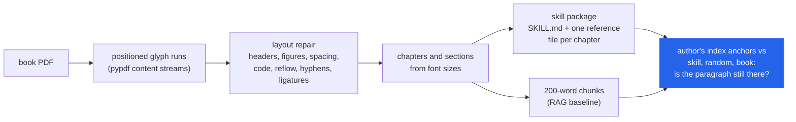

<h1 align="center">book-to-skill (PDF · BM25 · Claude Code skills · Ollama)</h1>
<p align="center"><i>Turn a technical book PDF into an agent skill, and measure how much of the book the skill still knows (outside definitions: no more than random sentences)</i></p>

<p align="center">
  <a href="#the-through-line">The through-line</a> &middot;
  <a href="#findings">Findings</a> &middot;
  <a href="#input--output">Input / Output</a> &middot;
  <a href="#quick-start">Quick start</a> &middot;
  <a href="#what-this-does-not-do">What it does NOT do</a> &middot;
  <a href="#problems-hit-while-building-this">Problems hit</a>
</p>

<p align="center">
  
  
  
  <a href="LICENSE"></a>
</p>

Inspired by [virgiliojr94/book-to-skill](https://github.com/virgiliojr94/book-to-skill); no code from it is used.

**Status:** extraction, retrieval and every number in this README: done. Model arm: built and tested against a fake; GPU run pending.

---

## The through-line



A skill is a compressed copy of the book that an agent reads instead of the book. This repo
builds the whole pipeline without a model (PDF to text, text to structure, structure to a
Claude Code skill), then asks the question the skill format hides: when the agent opens the
skill, is the passage that answers its question still in there?

The primary question set is the books' own **back-of-book index**: 1,348 terms from three
openly licensed books and two toolchains, each with the paragraph(s) where the author placed
the index anchor as its gold evidence. It depends neither on this pipeline nor on how the
skill writer picks sentences. A fixed 20% of terms (261) is a held-out test split. Extraction
is scored against an HTML edition of each book that the PDF was not involved in making.

> **Outside definitions, the skill keeps no more of the book than random sentences do; on the
> held-out index terms it keeps slightly less.** At 21% of each chapter's words, the
> extractive skill still holds the author's indexed paragraph for 39.5% of test terms; random
> sentences at the same budget hold it for 44.3% (sd 2.5 over 20 seeds): −4.9 points, 95% CI
> [−11.0, +1.0] resampling chapters. Its only advantage is its definitions regex: on the 16%
> of terms whose gold paragraph contains a defining phrase it keeps 95% (random 58%); on the
> other 84% it keeps 28.8% against random's 41.7% (−12.9 points, [−20.0, −6.2]). Reading the
> same 1,000 retrieved words, BM25 reaches the indexed paragraph 67% of the time over the
> book and 30% over the skill.

## Findings

Every number below is in a file under [`results/`](results/), produced by
`book-to-skill experiments`. Primary numbers are on the **index test split** (261 terms,
never used while building anything); the dev split (1,087 terms) and every other view are in
the same file. Intervals are 95% bootstraps over terms (2,000 resamples) unless marked
"by chapter", which resamples whole chapters because terms from one chapter share a skill
file. Random controls are the mean over 20 seeds at the variant's own word budget.

| | Measured on | Result | File |
|---|---|---|---|
| **Does the skill keep the evidence?** | index test, 261 terms, 3 books | Skill **39.5%** [33.3, 45.2]; random at the same budget **44.3%** (sd 2.5); difference **−4.9 points**, by chapter [−11.0, +1.0]. Dev split: 45.2% vs 46.1%, −1.0 [−4.1, +2.5] | `index_eval.json` → `pooled.test.controls` |
| **…without the glossary terms** | index test, 213 terms | Skill **32.9%** vs random **41.1%**: **−8.2 points**, by chapter [−15.4, −1.3] | `pooled.test_not_glossary_terms` |
| **Where the skill wins** | index test | Definitions regex matches 16.1% of gold paragraphs vs 3.3% of book sentences. Matched (42): skill **95.2%**, random 58.1%. Unmatched (219): skill **28.8%**, random **41.7%**, **−12.9 points** [−20.0, −6.2] | `…controls.definition_rule` |
| **RAG over the book vs the skill, equal reading** | index test | Indexed paragraph within the first 1,000 retrieved words: book chunks **67.1%** [61.3, 72.4], skill chunks **29.9%** [24.1, 35.6] (paired **−37.2 points** [−44.1, −30.3]), whole skill files **19.9%**, random-sentence chunks 26.4% | `pooled.test.corpora` |
| **Glossary set (secondary, 289 questions)** | bold-term gold sentences, 2 books | Skill **52.2%** vs random **27.3%**; but the regex matches 38.8% of these gold sentences (8x enrichment), and on the unmatched 177 the skill keeps 26.0% vs random 25.6% | `glossary_eval.json` |
| **Does layout repair matter downstream?** | index, all 1,348 | Without repair 6.6% of indexed paragraphs are no longer findable as text; recall@1,000 words **69.7% → 65.5%** (paired −4.2 [−6.1, −2.4]). Glossary set: 88.2% → 74.7% | `index_eval.json`, `glossary_eval.json` |
| **Extraction quality** | 48 chapters, 3 books, vs each book's HTML edition | token F1 vs pypdf's own `extract_text`: Think Python **0.950 → 0.975**, Think Stats **0.927 → 0.971**, Pro Git **0.997 → 0.999** | `extraction.json` |
| **Code listings** | 1,450 multi-line listings | recovered verbatim with indentation: Think Python **35% → 92%**, Think Stats **35% → 81%**, Pro Git **58% → 81%**; of the indented ones pypdf recovers 0%, 0% and 38% | `extraction.json` |
| **Structure vs the real table of contents** | 48 chapters, 459 sections | font-size detection finds **48/48** chapters and **459/459** sections (one extra section in Think Python), as good as reading the PDF's own bookmarks | `structure.json` |

### What the numbers say

**An extractive skill is a definitions index plus a random-ish sample, and the sample is worse
than random.** The writer keeps, per chapter, two lead sentences per section, up to twelve
sentences matching a defining-phrase regex ("is called", "refers to", "is defined as" ...),
up to four worked examples, and "when to use" topics. On terms whose indexed paragraph
contains such a phrase it keeps the evidence 95% of the time. Everywhere else it keeps it
28.8% of the time, and random sentences at the same word budget keep 41.7%: lead sentences
cluster at section starts, while an author's index anchors are spread through the text, so a
uniform sample covers more of them. Over all test terms the two effects roughly cancel
(−4.9 points, CI crossing zero); with glossary terms removed, the loss is clear (−8.2).

**The glossary result was the proxy talking.** On the secondary glossary set the skill beat
random by 25 points (52.2% vs 27.3%). That set's gold sentences are where the author set a
term in bold, i.e. where it is defined, which is exactly what the regex looks for: it
matches 38.8% of those gold sentences and 4.8% of book sentences. On the glossary questions
the regex does not match, the skill is at chance (26.0% vs 25.6%). The independent index
set confirms the reading: the definitions section is the only part that beats chance.

**Per book it is at chance or below, except Pro Git, where it is uncertain.** All index
terms, CI by chapter: Think Python +0.1 points [−3.3, +3.7], Think Stats −8.3 [−13.4, −3.7],
Pro Git +5.2 [−4.1, +15.1]. Pro Git is the book where the regex matches least (5% of gold
paragraphs), so the regex cannot explain its sign; but its test split (41 terms) goes the
other way (−4.8 [−19.4, +12.6]) and both intervals include zero, so it is not evidence that
the skill beats random there.

**At equal reading cost, retrieval over the skill is less than half as good as over the book.**
Book chunks average 157 words, skill chunks 164, whole skill files 668. Scoring whether the
indexed paragraph lies within the first N retrieved words (the unit crossing N is cut at N):
at 1,000 words the book reaches 67.1% of test terms, the chunked skill 29.9%, whole files
19.9%. The skill's ceiling is the 39.5% whose evidence survived at all.

**The matching threshold does not drive any of this.** A unit holds the evidence when it
contains at least 60% of the word trigrams of any gold sentence. At 40% and 80% the order of
the corpora is unchanged (`evidence_retained_by_threshold` in every view).

**Layout repair is a TeX problem.** On the two pdflatex books, repair lifts chapter token
F1 by 2.5 [2.3, 2.7] and 4.4 [3.8, 5.0] points, removes all 1,641 ligature glyphs and 545
broken line-end hyphenations, and makes 91% and 84% of indented listings recoverable where
pypdf recovers none. On Pro Git, set by Asciidoctor PDF with no ligatures and no
hyphenation, pypdf's own text is already at F1 0.997; repair adds 0.1 points, most of it from
removing page-number footers, and matters only for listings (58% → 81%). The skills keep 15%
(Think Python) and 20% (Think Stats) of the books' multi-line code listings.

**Structure detection on these born-digital books is close to solved, and that is not the
interesting part.** Font size alone recovers every chapter and section of all three books,
matching the PDF outline. Think Python sets "Chapter 7" as a separate larger line, and Pro
Git prints no chapter numbers, so unnumbered title-level headings with at least two sections
are numbered in order. Without layout repair 19/21, 13/14 and 12/13 chapters are found.
Outside these books it can fail (a thesis whose title page read as the only numbered chapter
produced a one-file skill; see Problems hit), so `convert` refuses when numbered chapters
hold under 20% of the text.

**Not a finding.** Book chunks contain 100% of the gold evidence because each question keeps
only the gold sentences found in the extracted PDF text (sources and PDFs are different
revisions). That 1.000 is a construction check, not a result.

### The question sets

**Index set (primary).** The authors placed an index anchor wherever a concept is discussed:
`\index{term}` in the Think books' LaTeX, `(((term)))` in Pro Git's Asciidoc (release
2.1.450). Each distinct term is a question, *"Where does the book explain X?"*; its gold
evidence is every sentence (5+ words) of the paragraph(s) its anchors sit in, within the
chapter of its first anchor. An anchor belongs to its own paragraph, or, if it sits in a block
with no prose (right after a heading), to the next paragraph. `a!b` subentries read as
"b a"; `git commands, add` reads as "git add". Anchors inside held-out glossaries and code
listings are ignored. Result: 1,348 terms (Think Python 722, Think Stats 417, Pro Git 209);
257 are also glossary terms and are flagged, and every result is also reported without them.
Terms were split into dev (80%) and test (20%) by a hash of book and term, committed before
any result was computed; nothing was tuned afterwards. Listed in
[`results/questions_index.jsonl`](results/questions_index.jsonl).

**Glossary set (secondary).** Every end-of-chapter glossary entry in the Think books' LaTeX is
a question with its definition as the reference answer; the gold sentence is where the author
set that term in bold. 289 questions after dropping 66 terms bold only in the glossary and one
reworded between LaTeX and PDF ([`results/questions_glossary.jsonl`](results/questions_glossary.jsonl)).
It is kept because it has reference answers for the model arm, and because it shows how a
question set that shares a proxy with the system under test inflates the result.

Glossary sections are held out of every corpus and of skill generation in both sets. The
skill writer never looks at bold type.

### The model arm (GPU run pending)

`book-to-skill model-arm` has a local model (`qwen2.5:14b-instruct` through Ollama) write
every chapter's reference file at the same word budget as the extractive file, measures that
skill's evidence retention and retrieval on **both** question sets (no model calls needed),
then answers the 289 glossary questions four ways: **closed book**, **RAG** (top-5 BM25 book
chunks), **skill** (the model reads SKILL.md, names a reference file, answers from it) and
**both**, each with the extractive and the model-written skill. Index questions have no
reference answer, so they are not used for answering. Answers are graded by token F1 against
the glossary definition and by the same model as a judge. Every generation is cached on disk
by (model, prompt, options), so a stopped run resumes. `tests/test_model_arm_run.py` runs
`model_arm.run()`, `plan()` and the `model-arm` command end to end on a two-chapter PDF with
a fake transport. It has not been run on a model: `scripts/run_models.sh --dry-run` plans
**4,081 requests** (35 generation, 4,046 answer/route/judge), an upper bound, since identical
prompts are generated once.

## Input / Output

All six samples are pasted verbatim from the commands shown; where a sample is cut, the cut
is marked with `[...]` and says what was left out.

**1. A PDF whose correct answer is known** (`uv run python demo.py`, first 14 lines of its
output; the rest prints the skill it writes). The demo writes a six-page PDF with every
defect the repairs target planted in it, runs the pipeline and checks each one.

```
input: tiny-book.pdf, 6 pages, title found: 'A Tiny Book'

  PASS  running header removed
  PASS  page number offset found
  PASS  chapter opener kept
  PASS  figure label dropped
  PASS  line-break hyphen joined
  PASS  real compound kept
  PASS  code indentation kept
  PASS  space at font change
  PASS  chapters
  PASS  sections

10/10 checks passed against the known answer
```

**2. A real page, before and after** (`uv run python scripts/before_after.py`, Think Python
PDF page 34). pypdf's `extract_text()`, first 12 lines of the page:

```
12 Chapter 2. Variables, expressions and statements
• Parentheses have the highest precedence and can be used to force an expression to
evaluate in the order you want. Since expressions in parentheses are evaluated first,
2 * (3-1) is 4, and (1+1)**(5-2) is 8. You can also use parentheses to make an
expression easier to read, as in (minute * 100) / 60 , even if it doesn’t change the
result.
• Exponentiation has the next highest precedence, so 1 + 2**3 is 9, not 27, and 2 *
3**2 is 18, not 36.
• Multiplication and Division have higher precedence than Addition and Subtraction.
So 2*3-1 is 5, not 4, and 6+4/2 is 8, not 5.
• Operators with the same precedence are evaluated from left to right (except exponen-
tiation). So in the expression degrees / 2 * pi , the division happens first and the
```

book-to-skill, first four blocks of the same page: running header gone, `fi` ligatures
expanded, `exponen-/tiation` rejoined, paragraphs reflowed.

```
[paragraph] • Parentheses have the highest precedence and can be used to force an expression to evaluate in the order you want. Since expressions in parentheses are evaluated first, 2 * (3-1) is 4, and (1+1)**(5-2) is 8. You can also use parentheses to make an expression easier to read, as in (minute * 100) / 60, even if it doesn’t change the result.
[paragraph] • Exponentiation has the next highest precedence, so 1 + 2**3 is 9, not 27, and 2 * 3**2 is 18, not 36.
[paragraph] • Multiplication and Division have higher precedence than Addition and Subtraction. So 2*3-1 is 5, not 4, and 6+4/2 is 8, not 5.
[paragraph] • Operators with the same precedence are evaluated from left to right (except exponentiation). So in the expression degrees / 2 * pi, the division happens first and the result is multiplied by pi. To divide by 2 π, you can use parentheses or write degrees / 2 / pi.
```

(`2 π` is a real remaining error: the math-font glyph is spaced from the digit.)

**3. A code listing** (same script, Think Stats PDF page 32). pypdf loses the indentation:

```
def MakePregMap(df):
d = defaultdict(list)
for index, caseid in df.caseid.iteritems():
d[caseid].append(index)
return d
```

book-to-skill rebuilds it from the glyphs' x positions:

```
def MakePregMap(df):
    d = defaultdict(list)
    for index, caseid in df.caseid.iteritems():
        d[caseid].append(index)
    return d
```

**4. A book that prints no chapter numbers** (`book-to-skill inspect data/raw/progit.pdf`,
complete output):

```
title: Pro Git
pages: 501   body font: 10.5pt   heading sizes: {'chapter': 22.0, 'section': 18.0}
repairs: 500 header/footer lines, 0 figure runs removed; 1 hyphenations joined (51 kept); 0 ligatures; 912 code blocks; 1 kerning splits
text inside numbered chapters: 92%
header/footer lines removed, e.g.: 1 | 2 | 3
    Pro Git  (p. 2-2)
    Table of Contents  (p. 3-3)
    License  (p. 7-7)
    Preface by Scott Chacon  (p. 8-8)
    Preface by Ben Straub  (p. 9-9)
    Dedications  (p. 10-10)
    Contributors  (p. 11-11)
    Introduction  (p. 14-15)
  1 Getting Started  (p. 16-31)
  2 Git Basics  (p. 32-68)
  3 Git Branching  (p. 69-110)
  4 Git on the Server  (p. 111-131)
  5 Distributed Git  (p. 132-171)
  6 GitHub  (p. 172-223)
  7 Git Tools  (p. 224-341)
  8 Customizing Git  (p. 342-372)
  9 Git and Other Systems  (p. 373-419)
 10 Git Internals  (p. 420-458)
  A Appendix A: Git in Other Environments  (p. 459-471)
  B Appendix B: Embedding Git in your Applications  (p. 472-483)
  C Appendix C: Git Commands  (p. 484-498)
    Index  (p. 499-499)
```

"1 hyphenations joined (51 kept)": Pro Git is ragged-right and never hyphenates words, and
the book's own attested cases tell the de-hyphenator so (see Problems hit).

**5. Search** (`book-to-skill search data/raw/thinkpython2.pdf "What is an accumulator?" -k 3`,
complete output; `search` does not hold out the glossary unless asked with
`--exclude-section Glossary`):

```
1. [chapter 10 / Map, filter and reduce] score 4.60
   res is initialized with an empty list; each time through the loop, we append the next element. So res is another kind of accumulator. An operation like capitalize_all is sometimes called a map because it “maps” a function (in this case the method capitalize) onto each of the elements in a sequence. ...
2. [chapter 10 / Glossary] score 4.50
   Glossary list: A sequence of values. element: One of the values in a list (or other sequence), also called items. nested list: A list that is an element of another list. accumulator: A variable used in a loop to add up or accumulate a result. augmented assignment: A statement that updates the value ...
3. [chapter 10 / Map, filter and reduce] score 3.99
   Map, filter and reduce To add up all the numbers in a list, you can use a loop like this: def add_all(t): total = 0 for x in t: total += x return total total is initialized to 0. Each time through the loop, x gets one element from the list. The += operator provides a short way to update a variable. ...
```

**6. The skill it writes** (complete output of `book-to-skill convert
data/raw/thinkpython2.pdf --title "Think Python 2e" --exclude-section Glossary --license
"Allen B. Downey, Green Tea Press, CC BY-NC 3.0 (...)" --out examples`; this is the skill the
evaluation scores, and the files are in [`examples/`](examples/)):

```
wrote examples\think-python-2e
  SKILL.md               529 words
  references/*.md      13400 words in 21 files
  chapter text         61699 words (82% of the book's text)
  reference / chapter words: 0.22
```

`examples/think-python-2e/SKILL.md`, first 16 of its 35 lines `[...]` (the
remaining rows of the chapter index cut):

```markdown
---
name: think-python-2e
description: "Knowledge from the book \"Think Python 2e\": The way of the program; Variables, expressions and statements; Functions; Case study: interface design; Conditionals and recursion; Fruitful functions; Iteration; Strings; Case study: word play; Lists; Dictionaries; Tuples; Case study: data structure selection; Files; Classes and objects; Classes and functions; Classes and methods; Inheritance; The Goodies; Debugging; Analysis of Algorithms. Use when a task needs the book's definitions, explanations or worked examples on these topics."
license: "Allen B. Downey, Green Tea Press, CC BY-NC 3.0 (https://creativecommons.org/licenses/by-nc/3.0/)"
---

# Think Python 2e

Extracted from *Think Python 2e*: Allen B. Downey, Green Tea Press, CC BY-NC 3.0 (https://creativecommons.org/licenses/by-nc/3.0/).

Each chapter of the book has a reference file with its sections, key definitions and worked examples. Find the chapter below whose topics match the task, then read only that file.

| Chapter | Topics | File |
|---|---|---|
| 1. The way of the program | formal, natural languages, tokens, hello world, ambiguity, meaning, instructions, basic | `references/ch01-the-way-of-the-program.md` |
| 2. Variables, expressions and statements | script, interactive mode, spam, precedence, illegal, semantic, comments, syntax error | `references/ch02-variables-expressions-and-statements.md` |
[...]
```

`references/ch10-lists.md`, its complete "Key definitions" section. This is where the
retained evidence lives, and the regex's misses are visible too: the fifth and the last
bullets are not definitions.

```markdown
## Key definitions

- The values in a list are called elements or sometimes items.
- A list that contains no elements is called an empty list; you can create one with empty brackets, [].
- isupper is a string method that returns True if the string contains only upper case letters.
- An operation like only_upper is called a filter because it selects some of the elements and filters out the others.
- We know that a and b both refer to a string, but we don’t know whether they refer to the same string.
- In one case, a and b refer to two different objects that have the same value.
- In the second case, they refer to the same object.
- To check whether two variables refer to the same object, you can use the is operator.
- In this example, Python only created one string object, and both a and b refer to it.
- If a refers to an object and you assign b = a, then both variables refer to the same object:
- The association of a variable with an object is called a reference.
- It almost never makes a difference whether a and b refer to the same string or not.
```

## Quick start

```bash
git clone https://github.com/hammasbuilds/book-to-skill
cd book-to-skill
uv sync
uv run pytest -q                 # 139 tests, no data, no network, no model
uv run python demo.py            # the known-answer PDF above

# your own book
uv run book-to-skill inspect mybook.pdf --sections
uv run book-to-skill convert mybook.pdf --out ~/.claude/skills --exclude-section Exercises \n    --license "Author, Publisher, licence"   # recorded in SKILL.md
uv run book-to-skill search mybook.pdf "what is a closure"

# reproduce every number in this README
bash scripts/fetch_data.sh       # three books + references, checked against data/MANIFEST.sha256
uv run book-to-skill experiments # about 31 minutes, writes results/

# the model arm (needs Ollama with qwen2.5:14b-instruct and a free GPU)
bash scripts/run_models.sh --dry-run
bash scripts/run_models.sh
```

## Layout

```
src/booktoskill/
  pdftext.py       pypdf visitor -> positioned runs; width tables via ToUnicode; figure (XObject) flag
  layout.py        the repairs: figures, headers/page numbers, spacing, code, reflow, hyphens, ligatures
  structure.py     chapters and sections from font sizes; numbering for books that print none
  chunking.py      ~200-word chunks, packed the same way for the book and for skill files
  bm25.py          Okapi BM25 and a light stemmer, from scratch
  skill.py         the extractive skill writer: SKILL.md index + per-chapter reference files
  references.py    HTML editions (hevea, Asciidoctor) and the glossary question set (secondary)
  index_questions.py  the index question set (primary): LaTeX \index and Asciidoc (((term)))
  metrics.py       token F1, code-listing recovery, evidence trigrams, term and chapter bootstraps
  evaluation.py    per-question records: retention, controls, regex split, retrieval by words read
  experiments.py   extraction and structure experiments, and run_all writing results/
  llm.py           Ollama client, disk cache keyed by (model, prompt, options), fake client
  llm_skill.py     the model writer for reference files, at the extractive file's word budget
  answering.py     closed book / RAG / skill / both, routing, judge, token F1
  model_arm.py     generation + QA end to end, and the dry-run plan
  samplepdf.py     writes small PDFs with known contents (demo and tests)
  cli.py           convert | inspect | search | experiments | model-arm
scripts/fetch_data.sh   downloads with resume and hashes
scripts/run_models.sh   the model arm, with RAM/GPU/Ollama checks and --dry-run
scripts/before_after.py prints Input/Output samples 2 and 3
results/                every number in this README
examples/               the extractive skills for both Think books
```

## Requirements

Python 3.11+ and `uv`. One runtime dependency, `pypdf` (pure Python); everything after the
content-stream decoding is standard library. The model arm additionally needs Ollama serving
`qwen2.5:14b-instruct` (about 9 GB of VRAM). No API keys.

## Tests

```bash
uv run pytest -q     # 139 tests, about 15 seconds
```

Every test builds its own input. The PDF tests write small PDFs with exact geometry (fonts
with declared width tables, a running header, a hyphen break, a figure drawn inside a form
XObject, indentation drawn as no-break spaces) and assert what comes back. The model arm is
driven by a deterministic fake client, including `model_arm.run()` and the `model-arm`
command end to end. A synthetic thesis (title page that reads like "1 ...", unnumbered
chapters) guards the structure fallback. No test reads `data/`, touches the network or loads a
model; `experiments` refuses to run and says why when the data is missing.

## What this does NOT do

- **No OCR.** A scanned PDF has no text layer; `convert` says so and stops.
- **No multi-column layout.** Lines are read top to bottom across the page, so two-column
  pages (each book's index, which is not used) come out interleaved.
- **No tables or display maths.** Table cells come out as lines; equations lose their
  structure (the HTML editions have `σ2`, `R2`, `∑` that the PDF text does not match).
- **Column alignment inside a code line is not recovered** when pypdf hands over the whole
  line as one run; indentation is, because it comes from the line's x position.
- **Only born-digital books from two toolchains were measured**: pdflatex (two books by one
  author with one template) and Asciidoctor PDF. A Word, InDesign or Sphinx book may break
  rules tuned here, the 0.06 em word-space threshold in particular.
- **The index set measures where a concept is discussed, not whether a question can be
  answered.** An index anchor marks a paragraph, and "the skill still contains a sentence of
  that paragraph" is a proxy for "the skill can help with that term". Index anchors are also
  uneven: many Think Python entries are Python keywords and names of example programs.
- **No answer accuracy.** The model arm that measures it has not been run, and it can only
  use the glossary set, the one with reference answers.

## Problems hit while building this

- **Font width tables lie about subsets.** Asciidoctor PDF embeds per-page subsets of its
  code font whose `/Widths` list every unused code at the `.notdef` width, so the font looked
  proportional and no code was detected. Monospace is now decided from the widths of the
  letters a font actually draws, and a tiny subset inherits its family's verdict.
- **Characters are not codes.** Prawn renumbers glyphs, so `widths[ord(ch) - FirstChar]`
  measured the wrong glyphs; widths are now read through each font's ToUnicode CMap
  (a 30-line parser in `pdftext.py`).
- **Indentation drawn as glyphs.** Prawn starts every code line at the same x and draws the
  indent as a no-break space plus spaces, so geometric indentation found nothing and Pro Git
  listings recovered worse than pypdf's plain text (50% vs 58%). pypdf's inferred spaces are
  plain spaces; only a run that starts with a no-break space is treated as drawn padding.
- **One hyphenation rule does not fit two typesetters.** "Keep the hyphen only if the
  hyphenated form occurs elsewhere" was right for TeX, which hyphenates ordinary words, and
  produced `branchmanagement` and `nondevelopers` in Pro Git, which only ever breaks at real
  hyphens. Unattested breaks now follow the majority of the book's attested ones.
- **A circled digit crashed the page-number detector.** `"②".isdigit()` is true in Python;
  Pro Git uses circled digits for code callouts. Found only because a third book was added.
- **Header removal ate chapter openers.** "Chapter 1" starts page 22 and carries the right
  page number for the page offset, so it looked like a running header. Headers must also sit
  in the band where most page-number lines sit.
- **Blank lines split code listings.** A blank line inside a listing opened a new block.
  A gap of up to about two line heights now stays inside the listing and becomes blank
  lines; together with comparing listings nested in list items dedented (the HTML keeps
  their outer indent, the PDF's x positions do not), Think Stats listing recovery went from
  34% to 81%.
- **Figure text is text.** Think Stats' matplotlib figures are embedded PDF with real text
  for every tick label: 1,271 runs, about 6% of the extracted tokens. Runs drawn inside form
  XObjects are now dropped, unless forms hold most of the book's text (some producers wrap
  whole pages in one).
- **Sections are not the most common heading.** "The most frequent size below chapter
  level" picked Pro Git's subsections (13 pt, more numerous than its 18 pt sections); it is
  now the largest size below chapter level that recurs, with "Chapter N" labels excluded.
- **The first question set was partly circular, and the first headline with it.** Gold
  sentences were where the author bolded a term; the skill's definitions regex looks for
  exactly those sentences (8x enrichment), which produced "52% vs 27% random". Rebuilding the
  evaluation on the authors' index anchors, with a held-out test split, turned the headline
  into its opposite for everything outside definitions.
- **Found by an independent review, and fixed.** (1) The ablated skill was compared with a
  random control at the *full* skill's budget and one seed, which made it look worse than
  chance; controls are now budget-matched per variant over 20 seeds. (2) "200-word" skill
  chunks averaged 44 words because the chunker split at every heading, and top-5 compared
  740 book words with 3,300 skill words; skill files are now packed like book chunks and the
  headline is recall at an equal number of words read. (3) One stray numbered heading (a
  thesis title page) switched off chapter numbering for the whole book, so `convert` wrote a
  one-file skill from 388 words and exited 0; numbering now needs most chapter-like headings
  to agree, and `convert` refuses below 20% coverage. (4) Non-ASCII titles crashed output on
  a Windows pipe. (5) README samples had been trimmed without marking the cuts.
- **greenteapress.com served the PDFs at about 6 KB/s** from here. `fetch_data.sh` resumes
  and checks every file against the hashes the results were produced from.

## Keywords

PDF text extraction &middot; layout analysis &middot; document structure &middot; Claude Code skills &middot; agent skills &middot; RAG &middot; BM25 &middot; retrieval evaluation &middot; evidence retention &middot; summarisation loss &middot; de-hyphenation &middot; ligatures &middot; code extraction &middot; local LLM &middot; Ollama &middot; reproducible evaluation

## License

Code: MIT. The books are not in this repository and keep their own licences: *Think Python
2e* and *Think Stats 2e* by Allen B. Downey (Green Tea Press, CC BY-NC 3.0) and *Pro Git*
by Scott Chacon and Ben Straub (CC BY-NC-SA 3.0); `data/raw/` is gitignored. `examples/`
contains extracts of the two Think books, shared under CC BY-NC 3.0 with that attribution;
`results/questions_*.jsonl` quote all three books under their licences ([`examples/NOTICE`](examples/NOTICE), [`results/NOTICE`](results/NOTICE); each
example `SKILL.md` carries it in its `license` field).
